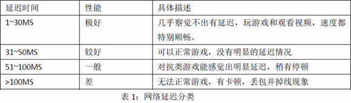
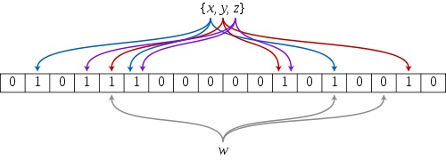

# FAQ

## 细节

### 如何进行code review

- 代码局部性
- 边界条件是否判断
- 资源使用鲁棒性提高经验

### 各个语言的差别

- c 和golang
  - 相同
    - 静态强类型编译语言
  - 不同
    - golang提供了GC
    - 指针操作

## leetCode

<details><summary>分类</summary>

- 数组
  - 有序
    - 双指针
    - 反向计算
  - 无序
    - 集合数据结构
    - 打表法
- String
- 树
  - 递归
  - while

- 哈希表
  - 求和
  - 最短路径
- 560 和为K的子数组
- 二分查找
  - 双指针
  - 贪心算法
  - 回溯算法
  - 链表
  - 位运算
  - 堆
  - 图

  - 排序
  - 并查集
  - 分治算法
  - 二叉搜索树
  - 字典树
  - sliding Window
  - 递归
  - 队列
  - Map
  - 拓扑排序
  - Random

</details>

### 动态规划(Dynamic Programming) DP

<details><summary>实现方式</summary>

> 若要解一个给定的问题，我们需要先解其不同的部门（子问题），再根据子问题的解以得出原问题的解。
> 确认原问题与子问题、动态规划状态、边界状态结值、状态转移方程等。

- 阶梯步骤
  - 确认原问题和子问题
  - 确认动态规划状态单一
  - 确认边界状态的值
  - 状态转移方程

- 64 Minimum Path Sum
  - dp[i][j] = grid[i][j] + min(dp[i - 1][j], dp[i][j - 1]);
- 118 Pascal's Triangle
  - dp.push_back(max(num[i] + dp[i - 2], dp[i - 1]));
- 119 Pascal's Triangle II
  - res[j] += res[j-1]
- 198 house Robber
  - max(dp[i-2] + nums[i], num[i-1])
- 213 house Robber II
- 爬楼梯
  - n(i) = n(i-1) + n(i-2) (i >= 3)
- 最大字段和

</details>

### 深度优先搜索 DFS

<details><summary>实现方式</summary>

1. 首先将根节点放入队列中。
2. 从队列中取出第一个节点，并检验它是否为目标。
   1. 如果找到目标，则结束搜寻并回传结果。
   2. 否则将它某一个尚未检验过的直接子节点加入队列中。
3. 重复步骤2。
4. 如果不存在未检测过的直接子节点。
   1. 将上一级节点加入队列中。
   2. 重复步骤2。
5. 重复步骤4。
6. 若队列为空，表示整张图都检查过了——亦即图中没有欲搜寻的目标。结束搜寻并回传“找不到目标”。

</details>

### 广度优先搜索 宽度优先搜索

<details>

 1. 首先将根节点放入队列中。
 2. 从队列中取出第一个节点，并检验它是否为目标。
    1. 如果找到目标，则结束搜索并回传结果。
    2. 否则将它所有尚未检验过的直接子节点加入队列中。
 3. 若队列为空，表示整张图都检查过了——亦即图中没有欲搜索的目标。结束搜索并回传“找不到目标”。
 4. 重复步骤2。

 </details>

## Unix

<details><summary></summary>

- 多线程如何跑在多核心上
- 虚拟内存系统的缓存
- 页表
  - 将虚拟页映射到物理页

</details>

### 内存屏障-memory barrier

<details><summary>解答</summary>

> 主要用处保证内存数据和处理器数据和缓存数据一致性，因为当某个处理器上改变某个变量X时，
> 那么其他处理器的X副本都必须失效，否则将会读取错误的值。大多数现代计算机为了提高性能而
> 采用乱序执行，写操作之后读操作之前插入内存屏障。

</details>

### 网络-基本名词

<details><summary>解答</summary>

> MSS = MTU - sizeof(TCPHDR) - sizeof(IPHDR)
> On receipt of the MSS option the calculation of the size of segmentthat 
>can be sent is:
> SndMaxSegSiz = MIN((MTU - sizeof(TCPHDR) - sizeof(IPHDR)), MSS)
> 

</details>

### 如何进行流量控制 //TODO

### TCP如何进行拥塞控制 //TODO

### golang-package-下载proxy配置

<details><summary>配置</summary>

```bash
export http_proxy=http://XXX
#GOPROXY 环境变量。如果设置了该变量，下载源代码时将会通过这个环境变量设置的代理地址
export GOPROXY=https://goproxy.io
```

</details>

### GC优化方式 //TODO

### C++推荐书单

<details> <summary>书单</sumary>

- C++ Primer
- STL源码剖析
- effective C++
- More Effective C++
- 深度探索C++对象模型
- C++设计新思维 Modern C++ Design : Generic Programming and Design Patterns Applied
- Exceptional C++ Style中文版

</details>

### static const 在类中定义 其他模板使用报错

### order of construction/desctructor call

<details>

```c++
class C::public B{};
class B::public A{};
class A {};
// constructor C->B->A, destroy A->B->C
```

</details>

### 如何理解C++内存管理

<details><summary>解答</summary>

> [memory management](http://www.gotw.ca/gotw/009.htm)

</details>

### 如何理解C++动态绑定，静态绑定

<details><summary>解答</summary>

> 静态绑定发生在编译期，动态绑定发生在运行期

</details>

### 如何理解虚基类

<details><summary>解答</summary>

- 虚基类
  - what
    - 让某也类做出声明，愿意共享他的基类,被共享的类称为虚基类(Virtual Base Class)
  - 作用
    - 虚基类的构造函数的调用早于其他非虚基类的构造函数的调用
    - 虚基类的派生类中只保留了一份虚基类的成员。
  - 解决了
    - 继承二义性问题

</details>

### gcc 中O1，O2，O3进行了什么优化

<details><summary>解答</summary>

- O1
  - 降低代码大小，可执行代码的运行速度
- O2
  - 提高目标代码的运行速度
- O3
  - 利用现代的CPU中的流水线，Cache等
  - finline-functions      // 采用一些启发式算法对函数进行内联
  - funswitch-loops        // 执行循环unswitch变换
  - fpredictive-commoning  //
  - fgcse-after-reload     //执行全局的共同子表达式消除

</details>

### 如何理解C++中的移动构造和移动复制构造

<details><summary>解答</summary>

> [doc](https://docs.microsoft.com/en-us/cpp/cpp/move-constructors-and-move-assignment-operators-cpp?view=vs-2017)

```cpp
class_name (class_name &&)
```

- copy costructor

```cpp
class_name (const class_name&)
```

</details>

## 如何理解std::forward

<details><summary>解答</summary>

- 转发左值为左值或右值
- 转发右值为右值，并禁止转发为左值

</details>

```c++
std::vector <std::pair<uint32_t, uint32_t>> data;

// for(auto it : data)
for(auto it = data.begin(); it != data.end(); it++)
{
    //error
    // data.insert(it, std::make_pair(i, i));
    it->first = i;
    it->second = i;
    ++i;
}
```

### shared_ptr, unique_ptr, weak_ptr

### cast

- 去const属性用const_cast。
- 基本类型转换用static_cast。
- 多态类之间的类型转换用daynamic_cast。
- 不同类型的指针类型转换用reinterpret_cast。

<details><summary>常用包使用</summary>

- regex
  - swap, assign, flags, getloc, imbue, mark_count, =
  - regex_match, regex_replace, regex_search
- string
  - [], at, back, front
  - begin, end, rbegin, rend
  - insert, append, pop_back, push_back, replace, erase
  - substr
  - clear, copy
  - compare
  - size, length
  - npos
- vector
  - capacity
  - front, back, at, [], data, assign
  - begin, end, rbegin, rend
  - push_back, pop_back
  - erase
  - reserve, size
- stack
  - top
  - push, pop
  - empty, size
- queue
  - front, back
  - push, pop, emplace
  - empty, size
  - swap
- deque
  - assign
  - front, back, at, []
  - push_back, push_front, pop_back, pop_back
  - empty, size
- list
  - front, back
  - push_back, pop_back, push_front, pop_front, emplace, insert
  - splice
- map
  - at, []
  - begin, cbegin, rbegin, end, cend, rend
  - find, count(key), upper_bound, low_bound
  - insert, emplace, emplace_hit, erase
  - swap, size
- unordered_map
  - at, []
  - begin, cbegin, end, cend
  - find, count(key)
  - insert, emplace, emplace_hit, erase
  - empty, size, clear
- set
  - begin, cbegin, end, cend, rbegin, rend
  - count, find, size, empty
  - emplace, emplace_hit, insert, erase, swap, clear, insert
- unordered_set
- thread
  - detach, join
  - get_id, joinable
  - swap, native_handle, operator=
- this_thread
  - get_id
  - sleep_for, sleep_until
  - yield
- atomic
  - is_lock_free
  - store, load, operator T, exchange
  - compare_exchange_weak, compare_exchange_strong
  - fetch_add, fetch_sub, fetch_and, fetch_or, fetch_xor, operator++, operator--
  - atomic::operator(com. assign.)
- future
  - share
  - get, valid, wait, wait_for, wait_until
  - std::future_status::[ready, timeout, deferred]
- chrono
  - duration, duration_values
  - high_resolution_clock, steady_clock, system_clock
  - time_point
  - functions-> duration_cast, time_point_cast 
  - std::chrono::hours, microseconds, milliseconds, minutes, nanoseconds, seconds
- functional
  - functions -> bind, cref, mem_fn, not1, not2, ref
  - wrapper class-> binary_negate, function, reference_wrapper, unary_negate
  - operator class
    - bit_and, bit_or, bit_xor, divides, equal_to, greater, greater_equal
    - less, less_equal, logical_and, logical_not, logical_or
    - minus, modulus, multiplies, negate, not_equal_to, plus
  - other_class
    - bad_function_call, hash, is_bind_expression, is_placeholder
  - namespaces-> placeholders
  - deprecated
    - binary_function, bind1st, bind2nd, binder1st, binder2nd
    - const_mem_fun1_ref_t, const_mem_fun1_t
    - mem_fun_ref, ptr_fun, mem_fun_t
- memory
  - auto_ptr
    - get, *, ->, =, release, reset
  - auto_ptr_ref
  - shared_ptr
    - =, swap, reset, get, *, ->, bool, use_count, unique, owner_before
    - make_shared
  - weak_ptr
    - =, swap, reset, user_count, expired, lock, owner_before
  - unique_ptr
    - =, get, get_deleter, bool, release, reset, swap, *, ->
  - default_delete
    - ()-> ::delete(ptr), ::delete[](ptr)
- algorithm
  - Non-modifying seq operations
    - all_of, any_of, none_of
    - for_each, find, find_if, find_if_not, find_end, find_first_of, adjacent_find
    - count, count_if, mismatch
    - equal, is_permutation(判断两个容器是否相同)
    - search, search_n
  - modifying sequence operations
    - copy, copy_n, copy_if, copy_backward
    - move, move_backward
    - swap, swap_ranges
    - iter_swap
    - transform
    - replace, replace_if, replace_copy, replace_copy_if
    - fill, fill_n
    - generate, generate_n
    - remove, remote_if, remove_copy, remote_copy_if
    - unique, unique_copy
    - reverse, reverse_copy
    - rotate, rotate_copy
    - random_shuffle, shuffle
  - Partitions
    - is_partitioned, partition, stable_partition
    - partition_copy, partition_point
  - Sort
    - sort, stable_sort, partial_sort, partial_sort_copy
    - is_sorted, is_sorted_until, nth_element
  - Binary Search
    - lower_bound
    - upper_bound
    - equal_range
    - binary_search
  - Merge
    - merge, inplace_merge, includes
    - set_union, set_intersection, set_difference, set_symmetric_difference
  - Heap
    - push_heap, pop_heap, make_heap, sort_heap
    - is_heap, is_heap_util
  - Min/Max
    - min, max, minmax
    - min_element, max_element, minmax_element
  - Other
    - lexicographical_compare
    - next_permutation
    - prev_permutation
- mutex
  - lock, try_lock, unlock, native_handle
  - lock_guard, unique_lock
  - once_falg, adopt_lock_t, defer_lock_t, try_to_lock_t
  - try_lock, lock, call_once
- utility
  - swap
  - make_pair
  - forward
  - move
  - move_if_noexcept
  - declval
- sstream
- cmath
  - abs, ceil, cbrt, round
  - fabs, fmax, fmin, fmod, fdim
  - pow, log, exp
  - sin

</details>

### atomic

```c++
atomic<bool>(false) error, atomic<bool>{false}
```

## protobuf

> [序列化反序列化使用建议等](https://blog.csdn.net/carson_ho/article/details/70568606)
> Tag-Length-Value的数据保存方式

- 序列化
  - 不同数据类型采用不同的序列化方式，整形采用T-V,没有保存length，减少消息长度。
  - zigzag编码达到无符号数表示有符号数。
  - 嵌套字段, repeated时 packet=true。
- 反序列化
- 优化
  - optional repeated多用
  - field_num 1-15
  - repeated + packet=true
  - 负数使用sint32, sint64

## 测试

- 数据集、需要测试的代码、测试标准
- 逻辑 性能 可用性

## redis

### 线程模型

> 单进程多线程

### 数据结构

- sorted set

> skipList 和dict 实现

- sds->string

<details><summary>数据结构细节</summary>

```c
//sds, 优化返回当前长度和剩余长度复杂度都是O(1)
 struct sdshdr {
   int len;
   int free;
   char buf[];
};
// 返回sdshdr.len
static inline size_t sdslen(const sds s) {
    struct sdshdr *sh = (void*)(s-(sizeof(struct sdshdr)));
    return sh->len;
}

// 返回sdshdr.free
static inline size_t sdsavail(const sds s) {
    struct sdshdr *sh = (void*)(s-(sizeof(struct sdshdr)));
    return sh->free;
}
```
</details>

### 复制

- 旧版本

> 同步-sync和命令传播-command propagate两个操作
> 通信过程:1.从服务器连接到主服务器 发送Sync，2. BGSAVE命令记录RDB，发送快照RDB, 3. 发送缓冲区保存的所有写命令
> 增量同步： 发送命令

- 新版本

> 复制挤压缓冲区,

<details><summary>实现细节</summary>

```c
//syncWithMaster
//ping auth 准备好解析rdb
void syncWithMaster(aeEventLoop *el, int fd, void *privdata, int mask) {}
 /* ---------------------------------- MASTER -------------------------------- */  
void createReplicationBacklog(void) /* 创建复制积压缓冲区 */  
void resizeReplicationBacklog(long long newsize) /* 调整复制积压缓冲区的大小*/  
void freeReplicationBacklog(void) /* 释放复制积压缓冲区*/  
void feedReplicationBacklog(void *ptr, size_t len) /* 将写命令添加到复制积压缓冲区*/  
void feedReplicationBacklogWithObject(robj *o) /*将写命令添加到复制积压缓冲区，但以对象的格式作为参数 */ 
void replicationFeedSlaves(list *slaves, int dictid, robj **argv, int argc) /* 将主数据库复制到从数据库 */  
void replicationFeedMonitors(redisClient *c, list *monitors, int dictid, robj **argv, int argc) /* 发送数据给monitor监听者 */  
long long addReplyReplicationBacklog(redisClient *c, long long offset) 
/* 将复制积压缓冲区的offset到end的添加client的reply*/
int masterTryPartialResynchronization(redisClient *c) /* 主服务器尝试部分重同步 */  
void syncCommand(redisClient *c) /* 同步命令函数 */  
void replconfCommand(redisClient *c) /* 此函数用于从服务器进行配置复制进程中的执行参数设置 */  
void sendBulkToSlave(aeEventLoop *el, int fd, void *privdata, int mask) /* 给slave发送BULK数据 */  
void updateSlavesWaitingBgsave(int bgsaveerr, int type) /* 此方法将用于后台保存进程快结束时调用，更新slave */        
/* ----------------------------------- SLAVE -------------------------------- */  
void replicationAbortSyncTransfer(void) /* 中止与master的同步操作 */  
void replicationSendNewlineToMaster(void)  
void replicationEmptyDbCallback(void *privdata)  
void readSyncBulkPayload(aeEventLoop *el, int fd, void *privdata, int mask) 
/* 从服务器读取同步的Sync的BULK数据 */  
char *sendSynchronousCommand(int flags, int fd, ...)  /* 从服务器给主服务器进行同步数据的命令和接收相应的回复 */  
int slaveTryPartialResynchronization(int fd) /* 从服务器尝试部分重同步操作 */  
void syncWithMaster(aeEventLoop *el, int fd, void *privdata, int mask) 
/* 与主服务器保持同步，期间包括发送ping命令,身份验证,发送端口信息 */  
int connectWithMaster(void) /* 连接服务器，设置事件回调 syncWithMaster*/  
void undoConnectWithMaster(void) /* 断开与主服务器的连接 */  
int cancelReplicationHandshake(void) /* 当已经存在一个复制进程时，中止一个非阻塞的replication复制的尝试 */  
void replicationSetMaster(char *ip, int port) /* 设置主服务器的ip地址和端口号 */  
void replicationUnsetMaster(void)  
void slaveofCommand(redisClient *c)  
void roleCommand(redisClient *c)  
void replicationSendAck(void) /* 发送ACK包给主服务器 ，告知当前的进程偏移量 */       
/* ---------------------- MASTER CACHING FOR PSYNC -------------------------- */  
void replicationCacheMaster(redisClient *c)  /*缓存主服务器信息 */  
void replicationDiscardCachedMaster(void) /* 当某个从服务器将不会再回复的时候，可以释放掉缓存的主服务器信息 */  
void replicationResurrectCachedMaster(int newfd) /* 将缓存主服务器复活 */       
/* ------------------------- MIN-SLAVES-TO-WRITE  --------------------------- */  
void refreshGoodSlavesCount(void) /*刷新延迟小于阈值的slave的数量*/  
void replicationScriptCacheInit(void)  
void replicationScriptCacheFlush(void)  
void replicationScriptCacheAdd(sds sha1)  
int replicationScriptCacheExists(sds sha1)  
void replicationCron(void) //主从复制的调度中心
```
</details>

### checkpoint

- 从服务器载入RDB文件时，阻塞不处理命令

### 主从切换

## Leveldb

### 组件

> batch, jurnal_log, memDB, ssTable

- sstable
  - 内容
    - datablock
      - restart point
      > 类似于字典树一样，由于每个Restart point存储的都是完整的key值，因此在sstable中进行数据查找时，可以首先利用restart point点的数据进行键值比较，以便于快速定位目标数据所在的区域；
    - filterblock bloom filter
      - filter data
      - filter n offset, base Lg(1Byte)-默认11表示每2kb的数据，创建一个过滤器来存放过滤数据
    - meta index block结构
      - filter block在整个sstable中的索引信息
  - 优势
    - 索引和BloomFilter等元数据可随文件一起创建和销毁，即直接存在文件里，不用加载时动态计算，不用维护更新

### 如何保证进程异常退出，数据的一致性

> 前者中可能存储一个写操作的部分写已经被记载到日志文件中，仍然有部分写未被记录，这种情况下，当数据库重新启动恢复时，读到这条日志记录时，发现数据异常，直接丢弃或退出，实现了写入的原子性保障。后者，写日志已经完成，已经数据未真正持久化，数据库启动恢复时通过redo日志实现数据写入，仍然保障了原子性。[](https://leveldb-handbook.readthedocs.io/zh/latest/_images/batch.jpeg)

```go
// fileStorage is a file-system backed storage.
type fileStorage struct {
	path     string
	readOnly bool

	mu      sync.Mutex
	flock   fileLock
	slock   *fileStorageLock
	logw    *os.File
	logSize int64
	buf     []byte
	// Opened file counter; if open < 0 means closed.
	open int
	day  int
}

// memStorage is a memory-backed storage.
type memStorage struct {
	mu    sync.Mutex
	slock *memStorageLock
	files map[uint64]*memFile
	meta  FileDesc
}

//memDB
// DB is an in-memory key/value database.
//skiplist
type DB struct {
	cmp comparer.BasicComparer
	rnd *rand.Rand

	mu     sync.RWMutex
	kvData []byte
	// Node data:
	// [0]         : KV offset
	// [1]         : Key length
	// [2]         : Value length
	// [3]         : Height
	// [3..height] : Next nodes
	nodeData  []int
	prevNode  [tMaxHeight]int
	maxHeight int
	n         int
	kvSize    int
}

type dbIter struct {
	util.BasicReleaser
	p          *DB //MEMDB
	slice      *util.Range
	node       int
	forward    bool
	key, value []byte
	err        error
}

//SSDB

```

### levelDB的数据结构

> 第一层oplog
> 第二层memetable是在内存中
> 磁盘中是sstable，氛围 datablock, metablock

### Cache如何实现

> 通过两个链表和一个hashmap实现

### 多个Set之后，单一Get是如何获取数据的

### bloom filter实现了什么功能

> 二进制向量和一系列随机映射函数,检索一个元素是否在一个集合中.有点空间效率和查询时间远远超过一般算法，有一定的误识别率和删除困难。多个
> hash函数进行判断，如果有一个不在则元素肯定不在集合中，如果都是1则说并数据在的概率比较大。

## rocksDB
  
## etcd

- key value
  - bTree version control

## 安全

### 什么是缓冲器溢出安全漏洞，如何防范 TODO

## 编译

### 列出典型寄存器并说出其中的作用

<details>

- 数据寄存器
- 指针及变地址寄存器
  - esp 栈指针寄存器
  - sp堆栈指针寄存器
  - bp基地址寄存器
  - si源变址寄存器
  - di目标变址寄存器
- 段寄存器
- 控制寄存器

</details>

### 进程的内存布局

<details><summary>说明</summary>

```md
高地址
------
stack
------
  ⬇

  ⬆
------
heap
------
bss段（未初始化 initialized to zero by exec）
---------------------
data段  read from program file by exec
-----
代码段
--------------------
低地址

- 栈
> 存储局部、临时变量、函数调用时，存储函数返回指针，用于控制函数的返回。在程序开始时自动分配
>内存，结束时自动释放内存，
```

</details>

### C编程如何打印errno

<details><summary>c++</summary>

```c

if(read(fd, buf, 1) == -1)
{
  printf("oh dear, something went wrong with read()! %s \n", strerror(errno));
}

```

</details>

### GCC基础介绍

<details><summary>基础知识</summary>

- gcc -I/path -L/path
  - -I /path path to include, gcc will find .h files in this path
  - -L /path contains library files, .a, .so
- 编译-------------
- ggdb
- Wall
  - Wall 允许发出Gcc提供的所有有用的报警信息
- Werror
  - 视警告为错误,出现任何警告就放弃编译
- Wextra
  - 打印额外的警告信息
- w
  - 禁止显示所有警告信息
- ggdb
  - 产生gdb需要的调试信息
- g
  - 可以产生复合操作系统本地格式的调试信息(stabs, coff, xcoff, dwarf2)
- 链接-------------
- Wl,dn
  - 静态链接库, 其他写法-dn, -non_shared, -static, Bstatic
- Wl,dy
  - 动态链接库, -dy, -call_shared, Bdynamic

```bash
//生成.o文件
gcc -c hello.cpp -o hell.o
```

- [lpthread, pthread区别](https://stackoverflow.com/a/23251828/5005060)
- [$<, $@含义](https://stackoverflow.com/a/37701195/5005060)
- [maketutor](http://www.cs.colby.edu/maxwell/courses/tutorials/maketutor/)

</details>

### C++如何实践gorutine //TODO

### 如何解决小包问题

<details><summary>Proxy, Controller, Worker</summary>

- Proxy负责包的收，将包放在不同的共享内存中
- Worker 多个worker组成group然后，消费共享内存中的数据
- Controller 负责Proxy，Worker的存在性，存活性检查

</details>

### 如何判断channel的空和满

<details><summary>select</summary>

```golang
ch := make(chan int, 1)
ch <- 1
select {
  case ch <- 2:
  fmt.Println("channel is empty");
  default:
  fmt.Println("channel is full !");
}
```

</details>

### 高并发编程中 进程、线程、IO多路复用的优缺点 //TODO

<details><summary>总结</summary>

- 多线程
  - 特点
    - 独立的虚拟地址空间
    - 控制流显示的使用某种技术，进行进程间通信
    - 共享文件表,不共享用户地址空间，
  - 使用
    - fork 之后 已连接的描述符副本，文件表中的引用计数+1
    - 子进程退出时，已经连接的文件描述符的副本将自动关闭
  - 优势
  - 劣势
    - 多进程间共享数据比较困难，需要IPC，比较慢，开销高
- IO多路复用-(I/O multiplexing)
  - 特点
    - 一个进程的上下文中显示的调用他们自己的逻辑流
    - 所有的程序共享一个地址空间
- 多线程
  - 特点
    - 线程是运行在一个单一进程上下文中的逻辑流，由内核进行调度
    - 共享同一个虚拟地址空间
  - 优势
  - 劣势

</details>