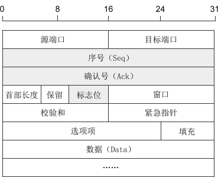
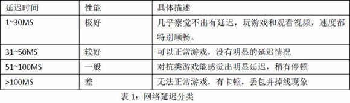
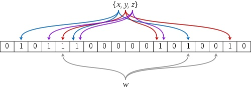

# FAQ

<details><summary>如何进行code review</summary>

- 代码局部性
- 边界条件是否断
- 是否有资源泄漏

</details>

### TCP-HTTP

<details><summary>http 状态码301，302作用</summary>

- [参考](https://www.jianshu.com/p/93555718732a)
- 1XX 信息性状态码
- 2XX 成功状态码
- 3XX 用户已经移动的文件并且常被包含在头信息中指定的新的地址信息
  - 301 文档在别处，新的地址在头信息中
  - 302 与301相同，只是在头信息中所给的URL是临时的。
- 4XX 用户指定客户端的错误
  - 401 未授权
- 5XX 用户指定服务器的错误
  - 500 服务器内部错误
  - 501 未实现
  - 502 网关错误
  - 503 服务无法获取
  - 504 网关超时
  - 505 不支持的HTTP版本

</details>

<details><summary>描述TCP三次握手四次挥手过程</summary>

#### 三次握手

- client 发送 SYN SEQ=100，(SYN-SEND)
- server接收到 发送SYN SEQ=200， ACK=101 (SYN-RECE)
- client 接收到后发送 ACK=201 established

#### 四次挥手

- client 发送 FIN Seq=4000 进入 FIN_WAIT_1
- server 发送 ACK=4001  进入 CLOSE_WAIT
- client 接收 ACK=4001  进入  FIN_WAIT_2
- server 发送 FIN Seq=5000 ACK=4001 进入  LAST_ACK
- client 接收 FIN 回复ACK Ack=5001 Seq=4001 进入 TIME_WAIT
- server 接收 ACK 进入 CLOSED
- client 经过 2MSL进入 CLOSED

#### TCP报文头


1) 序号：Seq（Sequence Number）序号占32位，用来标识从计算机A发送到计算机B的数据包的序号，计算机发送数据时对此进行标记。
2) 确认号：Ack（Acknowledge Number）确认号占32位，客户端和服务器端都可以发送，Ack = Seq + 1。
3) 标志位：每个标志位占用1Bit，共有6个，分别为 URG、ACK、PSH、RST、SYN、FIN，具体含义如下：
URG：紧急指针（urgent pointer）有效。
ACK：确认序号有效。
PSH：接收方应该尽快将这个报文交给应用层。
RST：重置连接。
SYN：建立一个新连接。
FIN：断开一个连接。
对英文字母缩写的总结：Seq 是 Sequence 的缩写，表示序列；Ack(ACK) 是 Acknowledge 的缩写，表示确认；SYN 是 Synchronous 的缩写，愿意是“同步的”，这里表示建立同步连接；FIN 是 Finish 的缩写，表示完成。

</details>

<details><summary>各个语言的差别 //TODO</summary>

- c 和golang
  - 相同
    - 静态强类型编译语言
  - 不同
    - golang提供了GC
    - 指针操作

</details>

## leetcode

<details><summary>leetCode待总结分类</summary>

- 数组
  - 有序
    - 双指针
    - 反向计算
  - 无序
    - 集合数据结构
    - 打表法
- String
- 树
  - 递归
  - while

- 哈希表
  - 求和
  - 最短路径
- 560 和为K的子数组
- 二分查找
  - 双指针
  - 贪心算法
  - 回溯算法
  - 链表
  - 位运算
  - 堆
  - 图

  - 排序
  - 并查集
  - 分治算法
  - 二叉搜索树
  - 字典树
  - sliding Window
  - 递归
  - 队列
  - Map
  - 拓扑排序
  - Random

</details>

<details><summary>动态规划(Dynamic Programming) DP</summary>

> 若要解一个给定的问题，我们需要先解其不同的部门（子问题），再根据子问题的解以得出原问题的解。<br/>
>确认原问题与子问题、动态规划状态、边界状态结值、状态转移方程等。

- 阶梯步骤
  - 确认原问题和子问题
  - 确认动态规划状态单一
  - 确认边界状态的值
  - 状态转移方程

- 64 Minimum Path Sum
  - dp[i][j] = grid[i][j] + min(dp[i - 1][j], dp[i][j - 1]);
- 118 Pascal's Triangle
  - dp.push_back(max(num[i] + dp[i - 2], dp[i - 1]));
- 119 Pascal's Triangle II
  - res[j] += res[j-1]
- 198 house Robber
  - max(dp[i-2] + nums[i], num[i-1])
- 213 house Robber II
- 爬楼梯
  - n(i) = n(i-1) + n(i-2) (i >= 3)
- 最大字段和

</details>

<details><summary>深度优先搜索 DFS</summary>

1. 首先将根节点放入队列中。
2. 从队列中取出第一个节点，并检验它是否为目标。
   1. 如果找到目标，则结束搜寻并回传结果。
   2. 否则将它某一个尚未检验过的直接子节点加入队列中。
3. 重复步骤2。
4. 如果不存在未检测过的直接子节点。
   1. 将上一级节点加入队列中。
   2. 重复步骤2。
5. 重复步骤4。
6. 若队列为空，表示整张图都检查过了——亦即图中没有欲搜寻的目标。结束搜寻并回传“找不到目标”。

</details>

<details><summary>广度优先搜索 宽度优先搜索</summary>

 1. 首先将根节点放入队列中。
 2. 从队列中取出第一个节点，并检验它是否为目标。
    1. 如果找到目标，则结束搜索并回传结果。
    2. 否则将它所有尚未检验过的直接子节点加入队列中。
 3. 若队列为空，表示整张图都检查过了——亦即图中没有欲搜索的目标。结束搜索并回传“找不到目标”。
 4. 重复步骤2。

 </details>

## Unix编程

<details><summary>Unix-常识</summary>

- 多线程如何跑在多核心上
- 虚拟内存系统的缓存
- 页表
  - 将虚拟页映射到物理页

</details>

<details><summary>内存屏障-memory barrier</summary>

> 主要用处保证内存数据和处理器数据和缓存数据一致性，因为当某个处理器上改变某个变量X时，
> 那么其他处理器的X副本都必须失效，否则将会读取错误的值。大多数现代计算机为了提高性能而
> 采用乱序执行，写操作之后读操作之前插入内存屏障。

</details>

<details><summary>GC优化方式 //TODO</summary></details>

## 网络

<details><summary>网络-基本名词</summary>

> MSS = MTU - sizeof(TCPHDR) - sizeof(IPHDR)
> On receipt of the MSS option the calculation of the size of segmentthat 
>can be sent is:
> SndMaxSegSiz = MIN((MTU - sizeof(TCPHDR) - sizeof(IPHDR)), MSS)
> 

</details>

<details><summary>如何进行流量控制 //TODO</summary></details>

<details><summary>TCP如何进行拥塞控制 //TODO</summary></details>

</details>

<details><summary>设计框架处理大量小包问题</summary>

> 连接和数据包

- Controller, Proxy, Worker-Group

</details>

<details><summary>简单描述下交换机、路由器、防火墙、无线设备的工作和运行原理//TODO</summary>
</details>

<details><summary>简要描述负载均衡，并说出几种实现方式，并指出性能上的瓶颈//TODO</summary>
</details>

## C++

<details> <summary>C++推荐书单</summary>

- C++ Primer
- STL源码剖析
- effective C++
- More Effective C++
- 深度探索C++对象模型
- C++设计新思维 Modern C++ Design : Generic Programming and Design Patterns Applied
- Exceptional C++ Style中文版

</details>

<details><summary>如何捕获各个线程间的异常</summary>

//TODO

</details>

<details><summary>static const 在类中定义 其他模板使用报错</summary>

</details>

<details><summary>order of construction/desctructor call</summary>

```c++
class C::public B{};
class B::public A{};
class A {};
// constructor C->B->A, destroy A->B->C
```

</details>

<details><summary>如何理解C++内存管理</summary>

> [memory management](http://www.gotw.ca/gotw/009.htm)

</details>

<details><summary>//TODO如何理解C++动态绑定，静态绑定</summary>

> 静态绑定发生在编译期，动态绑定发生在运行期

</details>

<details><summary>如何理解虚基类</summary>

- 虚基类
  - what
    - 让某也类做出声明，愿意共享他的基类,被共享的类称为虚基类(Virtual Base Class)
  - 作用
    - 虚基类的构造函数的调用早于其他非虚基类的构造函数的调用
    - 虚基类的派生类中只保留了一份虚基类的成员。
  - 解决了
    - 继承二义性问题

</details>

<details><summary>gcc 中O1，O2，O3进行了什么优化</summary>

- O1
  - 降低代码大小，可执行代码的运行速度
- O2
  - 提高目标代码的运行速度
- O3
  - 利用现代的CPU中的流水线，Cache等
  - finline-functions      // 采用一些启发式算法对函数进行内联
  - funswitch-loops        // 执行循环unswitch变换
  - fpredictive-commoning  //
  - fgcse-after-reload     //执行全局的共同子表达式消除

</details>

<details><summary>如何理解C++中的移动构造和移动复制构造</summary>

> [doc](https://docs.microsoft.com/en-us/cpp/cpp/move-constructors-and-move-assignment-operators-cpp?view=vs-2017)

```cpp
class_name (class_name &&)
```

- copy costructor

```cpp
class_name (const class_name&)
```

</details>

<details><summary>如何理解std::forward</summary>

- 转发左值为左值或右值
- 转发右值为右值，并禁止转发为左值

</details>

<details><summary>c++如何实现一个线程池</summary>

#### 基本要求

1. 返回异步执行方法
2. 能够查询到当前任务状态
3. 任务数量可控制

#### 提高

- 设计运行时动态调整线程数
- 可以设置线程超时时间
- 增加任务队列长度限制
- 底层用纤程的
- 支持多个线程池合并以复用资源的
- 脱离管程完全从底层实现的（仅以 POSIX 中 Futex 作为同步原语）
- 支持定时任务的
- 支持批量提交的

```c++
/*
* future, packaged_task, lock_guard<std::mutex>, mutex, condition_variable

//from
https://raw.githubusercontent.com/progschj/ThreadPool/master/ThreadPool.h
*/

#ifndef THREAD_POOL_H
#define THREAD_POOL_H

#include <functional>
#include <thread>
#include <vector>
#include <future>
#include <queue>
#include <condition_variable>
#include <mutex>
#include <iostream>


#define MAX_THREAD_NUM 256

class ThreadPool
{
public:
    ThreadPool(const int& maxSize);
    template<class F, class... Args>
    auto enqueue(F&& f, Args&& ... args) -> std::future<typename std::result_of<F(Args...)>::type>;

    ~ThreadPool();

private:
    using Task = std::function<void()>;
    int m_maxSize;
    std::vector<std::thread> m_workers;
    std::queue<std::function<void()>> m_tasks;

    std::mutex m_lock;
    std::condition_variable m_cv;
    bool m_stop;
};

ThreadPool::ThreadPool(const int& maxSize): m_maxSize(maxSize), m_stop(false)
{
    for(auto i = 0; i < maxSize; ++i)
        m_workers.emplace_back(
            [this]
    {
        for(;;)
        {
            std::function<void()> task;
            {
                std::unique_lock<std::mutex> lock(this->m_lock);
                m_cv.wait(lock, [this] {return m_stop || !m_tasks.empty();});

                if(m_stop && m_tasks.empty())
                    return;

                task = std::move(m_tasks.front());
                m_tasks.pop();
            }
            task();
        }
    }
    );
}

// add new work item to the pool
template<class F, class... Args>
auto ThreadPool::enqueue(F&& f, Args&& ... args) -> std::future<typename std::result_of<F(Args...)>::type>
{
    using return_type = typename std::result_of<F(Args...)>::type;

    auto task = std::make_shared<std::packaged_task<return_type()>>
                (std::bind(std::forward<F>(f), std::forward<Args>(args)...));
                // (std::bind(f, args...));

    std::future<return_type> res = task->get_future();
    {
        std::unique_lock<std::mutex> lock(m_lock);

        // don't allow enqueueing after m_stopping the pool
        if(m_stop)
            throw std::runtime_error("enqueue on m_stopped ThreadPool");

        m_tasks.emplace([task]() { (*task)(); });
    }
    m_cv.notify_one();
    return res;
}

// the destructor joins all threads
inline ThreadPool::~ThreadPool()
{
    {
        std::unique_lock<std::mutex> lock(m_lock);
        m_stop = true;
    }
    m_cv.notify_all();

    for(std::thread& worker : m_workers)
        worker.join();
}

#endif


```

</details>

<details><summary>shared_ptr, unique_ptr, weak_ptr</summary>
</details>

<details><summary>c++类型转换</summary>

- 去const属性用const_cast。
- 基本类型转换用static_cast。
- 多态类之间的类型转换用daynamic_cast。
- 不同类型的指针类型转换用reinterpret_cast。

</details>

<details><summary>实现多线程之间的异常传递，最后由主线程进行管理</summary>
//TODO
</details>

<details><summary>常用包使用</summary>

- regex
  - swap, assign, flags, getloc, imbue, mark_count, =
  - regex_match, regex_replace, regex_search
- string
  - [], at, back, front
  - begin, end, rbegin, rend
  - insert, append, pop_back, push_back, replace, erase
  - substr
  - clear, copy
  - compare
  - size, length
  - npos
- vector
  - capacity
  - front, back, at, [], data, assign
  - begin, end, rbegin, rend
  - push_back, pop_back
  - erase
  - reserve, size
- stack
  - top
  - push, pop
  - empty, size
- queue
  - front, back
  - push, pop, emplace
  - empty, size
  - swap
- deque
  - assign
  - front, back, at, []
  - push_back, push_front, pop_back, pop_back
  - empty, size
- list
  - front, back
  - push_back, pop_back, push_front, pop_front, emplace, insert
  - splice
- map
  - at, []
  - begin, cbegin, rbegin, end, cend, rend
  - find, count(key), upper_bound, low_bound
  - insert, emplace, emplace_hit, erase
  - swap, size
- unordered_map
  - at, []
  - begin, cbegin, end, cend
  - find, count(key)
  - insert, emplace, emplace_hit, erase
  - empty, size, clear
- set
  - begin, cbegin, end, cend, rbegin, rend
  - count, find, size, empty
  - emplace, emplace_hit, insert, erase, swap, clear, insert
- unordered_set
- thread
  - detach, join
  - get_id, joinable
  - swap, native_handle, operator=
- this_thread
  - get_id
  - sleep_for, sleep_until
  - yield
- atomic
  - is_lock_free
  - store, load, operator T, exchange
  - compare_exchange_weak, compare_exchange_strong
  - fetch_add, fetch_sub, fetch_and, fetch_or, fetch_xor, operator++, operator--
  - atomic::operator(com. assign.)
- future
  - share
  - get, valid, wait, wait_for, wait_until
  - std::future_status::[ready, timeout, deferred]
- chrono
  - duration, duration_values
  - high_resolution_clock, steady_clock, system_clock
  - time_point
  - functions-> duration_cast, time_point_cast 
  - std::chrono::hours, microseconds, milliseconds, minutes, nanoseconds, seconds
- functional
  - functions -> bind, cref, mem_fn, not1, not2, ref
  - wrapper class-> binary_negate, function, reference_wrapper, unary_negate
  - operator class
    - bit_and, bit_or, bit_xor, divides, equal_to, greater, greater_equal
    - less, less_equal, logical_and, logical_not, logical_or
    - minus, modulus, multiplies, negate, not_equal_to, plus
  - other_class
    - bad_function_call, hash, is_bind_expression, is_placeholder
  - namespaces-> placeholders
  - deprecated
    - binary_function, bind1st, bind2nd, binder1st, binder2nd
    - const_mem_fun1_ref_t, const_mem_fun1_t
    - mem_fun_ref, ptr_fun, mem_fun_t
- memory
  - auto_ptr
    - get, *, ->, =, release, reset
  - auto_ptr_ref
  - shared_ptr
    - =, swap, reset, get, *, ->, bool, use_count, unique, owner_before
    - make_shared
  - weak_ptr
    - =, swap, reset, user_count, expired, lock, owner_before
  - unique_ptr
    - =, get, get_deleter, bool, release, reset, swap, *, ->
  - default_delete
    - ()-> ::delete(ptr), ::delete[](ptr)
- algorithm
  - Non-modifying seq operations
    - all_of, any_of, none_of
    - for_each, find, find_if, find_if_not, find_end, find_first_of, adjacent_find
    - count, count_if, mismatch
    - equal, is_permutation(判断两个容器是否相同)
    - search, search_n
  - modifying sequence operations
    - copy, copy_n, copy_if, copy_backward
    - move, move_backward
    - swap, swap_ranges
    - iter_swap
    - transform
    - replace, replace_if, replace_copy, replace_copy_if
    - fill, fill_n
    - generate, generate_n
    - remove, remote_if, remove_copy, remote_copy_if
    - unique, unique_copy
    - reverse, reverse_copy
    - rotate, rotate_copy
    - random_shuffle, shuffle
  - Partitions
    - is_partitioned, partition, stable_partition
    - partition_copy, partition_point
  - Sort
    - sort, stable_sort, partial_sort, partial_sort_copy
    - is_sorted, is_sorted_until, nth_element
  - Binary Search
    - lower_bound
    - upper_bound
    - equal_range
    - binary_search
  - Merge
    - merge, inplace_merge, includes
    - set_union, set_intersection, set_difference, set_symmetric_difference
  - Heap
    - push_heap, pop_heap, make_heap, sort_heap
    - is_heap, is_heap_util
  - Min/Max
    - min, max, minmax
    - min_element, max_element, minmax_element
  - Other
    - lexicographical_compare
    - next_permutation
    - prev_permutation
- mutex
  - lock, try_lock, unlock, native_handle
  - lock_guard, unique_lock
  - once_falg, adopt_lock_t, defer_lock_t, try_to_lock_t
  - try_lock, lock, call_once
- utility
  - swap
  - make_pair
  - forward
  - move
  - move_if_noexcept
  - declval
- sstream
- cmath
  - abs, ceil, cbrt, round
  - fabs, fmax, fmin, fmod, fdim
  - pow, log, exp
  - sin

</details>

<details><summary>c++ atomic</summary>

```c++
atomic<bool>(false) error, atomic<bool>{false}
```

</details>

<details><summary>protobuf</summary>

> [序列化反序列化使用建议等](https://blog.csdn.net/carson_ho/article/details/70568606)
> Tag-Length-Value的数据保存方式

- 序列化
  - 不同数据类型采用不同的序列化方式，整形采用T-V,没有保存length，减少消息长度。
  - zigzag编码达到无符号数表示有符号数。
  - 嵌套字段, repeated时 packet=true。
- 反序列化
- 优化
  - optional repeated多用
  - field_num 1-15
  - repeated + packet=true
  - 负数使用sint32, sint64

</details>

## 测试

<details><summary>简单描述测试的流程和注意点</summary>

- 数据集、需要测试的代码、测试标准
- 逻辑 性能 可用性

</details>

## Redis

<details><summary>简单描述你对Redis的认识//TODO</summary>

> 单进程多线程

### 数据结构

- sorted set

> skipList 和dict 实现

- sds->string

</details>

<details><summary>Redis数据结构细节</summary>

```c
//sds, 优化返回当前长度和剩余长度复杂度都是O(1)
 struct sdshdr {
   int len;
   int free;
   char buf[];
};
// 返回sdshdr.len
static inline size_t sdslen(const sds s) {
    struct sdshdr *sh = (void*)(s-(sizeof(struct sdshdr)));
    return sh->len;
}

// 返回sdshdr.free
static inline size_t sdsavail(const sds s) {
    struct sdshdr *sh = (void*)(s-(sizeof(struct sdshdr)));
    return sh->free;
}
```
</details>

<details><summary>Redis复制如何实现</summary>

- 旧版本

> 同步-sync和命令传播-command propagate两个操作
> 通信过程:1.从服务器连接到主服务器 发送Sync，2. BGSAVE命令记录RDB，发送快照RDB, 3. 发送缓冲区保存的所有写命令
> 增量同步： 发送命令

- 新版本

> 复制挤压缓冲区,

### 实现细节

```c
//syncWithMaster
//ping auth 准备好解析rdb
void syncWithMaster(aeEventLoop *el, int fd, void *privdata, int mask) {}
 /* ---------------------------------- MASTER -------------------------------- */  
void createReplicationBacklog(void) /* 创建复制积压缓冲区 */  
void resizeReplicationBacklog(long long newsize) /* 调整复制积压缓冲区的大小*/  
void freeReplicationBacklog(void) /* 释放复制积压缓冲区*/  
void feedReplicationBacklog(void *ptr, size_t len) /* 将写命令添加到复制积压缓冲区*/  
void feedReplicationBacklogWithObject(robj *o) /*将写命令添加到复制积压缓冲区，但以对象的格式作为参数 */ 
void replicationFeedSlaves(list *slaves, int dictid, robj **argv, int argc) /* 将主数据库复制到从数据库 */  
void replicationFeedMonitors(redisClient *c, list *monitors, int dictid, robj **argv, int argc) /* 发送数据给monitor监听者 */  
long long addReplyReplicationBacklog(redisClient *c, long long offset) 
/* 将复制积压缓冲区的offset到end的添加client的reply*/
int masterTryPartialResynchronization(redisClient *c) /* 主服务器尝试部分重同步 */  
void syncCommand(redisClient *c) /* 同步命令函数 */  
void replconfCommand(redisClient *c) /* 此函数用于从服务器进行配置复制进程中的执行参数设置 */  
void sendBulkToSlave(aeEventLoop *el, int fd, void *privdata, int mask) /* 给slave发送BULK数据 */  
void updateSlavesWaitingBgsave(int bgsaveerr, int type) /* 此方法将用于后台保存进程快结束时调用，更新slave */        
/* ----------------------------------- SLAVE -------------------------------- */  
void replicationAbortSyncTransfer(void) /* 中止与master的同步操作 */  
void replicationSendNewlineToMaster(void)  
void replicationEmptyDbCallback(void *privdata)  
void readSyncBulkPayload(aeEventLoop *el, int fd, void *privdata, int mask) 
/* 从服务器读取同步的Sync的BULK数据 */  
char *sendSynchronousCommand(int flags, int fd, ...)  /* 从服务器给主服务器进行同步数据的命令和接收相应的回复 */  
int slaveTryPartialResynchronization(int fd) /* 从服务器尝试部分重同步操作 */  
void syncWithMaster(aeEventLoop *el, int fd, void *privdata, int mask) 
/* 与主服务器保持同步，期间包括发送ping命令,身份验证,发送端口信息 */  
int connectWithMaster(void) /* 连接服务器，设置事件回调 syncWithMaster*/  
void undoConnectWithMaster(void) /* 断开与主服务器的连接 */  
int cancelReplicationHandshake(void) /* 当已经存在一个复制进程时，中止一个非阻塞的replication复制的尝试 */  
void replicationSetMaster(char *ip, int port) /* 设置主服务器的ip地址和端口号 */  
void replicationUnsetMaster(void)  
void slaveofCommand(redisClient *c)  
void roleCommand(redisClient *c)  
void replicationSendAck(void) /* 发送ACK包给主服务器 ，告知当前的进程偏移量 */       
/* ---------------------- MASTER CACHING FOR PSYNC -------------------------- */  
void replicationCacheMaster(redisClient *c)  /*缓存主服务器信息 */  
void replicationDiscardCachedMaster(void) /* 当某个从服务器将不会再回复的时候，可以释放掉缓存的主服务器信息 */  
void replicationResurrectCachedMaster(int newfd) /* 将缓存主服务器复活 */       
/* ------------------------- MIN-SLAVES-TO-WRITE  --------------------------- */  
void refreshGoodSlavesCount(void) /*刷新延迟小于阈值的slave的数量*/  
void replicationScriptCacheInit(void)  
void replicationScriptCacheFlush(void)  
void replicationScriptCacheAdd(sds sha1)  
int replicationScriptCacheExists(sds sha1)  
void replicationCron(void) //主从复制的调度中心
```

</details>

<details><summary>Redis 写入 string如何实现，涉及到的数据结构有哪些</summary>

```c

//和redis各种数据对象绑定
typedef struct redisObject {
    unsigned type:4;
    unsigned encoding:4;
    unsigned lru:LRU_BITS; /* LRU time (relative to global lru_clock) or
                            * LFU data (least significant 8 bits frequency
                            * and most significant 16 bits access time). */
    int refcount;
    void *ptr;
} robj;

/* Redis database representation. There are multiple databases identified
 * by integers from 0 (the default database) up to the max configured
 * database. The database number is the 'id' field in the structure. */
typedef struct redisDb {
    dict *dict;                 /* The keyspace for this DB */
    dict *expires;              /* Timeout of keys with a timeout set */
    dict *blocking_keys;        /* Keys with clients waiting for data (BLPOP)*/
    dict *ready_keys;           /* Blocked keys that received a PUSH */
    dict *watched_keys;         /* WATCHED keys for MULTI/EXEC CAS */
    int id;                     /* Database ID */
    long long avg_ttl;          /* Average TTL, just for stats */
    list *defrag_later;         /* List of key names to attempt to defrag one by one, gradually. */
} redisDb;

/* With multiplexing we need to take per-client state.
 * Clients are taken in a linked list. */
typedef struct client {
} client;

//t_string.c
/* SET key value [NX] [XX] [EX <seconds>] [PX <milliseconds>] */
//embstr, sds
void setCommand(client *c){
    int j;
    robj *expire = NULL;
    int unit = UNIT_SECONDS;
    int flags = OBJ_SET_NO_FLAGS;

    for (j = 3; j < c->argc; j++) {
      if()
      {
      } else {
        addReply(c,shared.syntaxerr);
        return;
      }
    }
    c->argv[2] = tryObjectEncoding(c->argv[2]);
    setGenericCommand(c,flags,c->argv[1],c->argv[2],expire,unit,NULL,NULL);

};
void setGenericCommand(client *c, int flags, robj *key, robj *val, robj *expire, int unit, robj *ok_reply, robj *abort_reply) {
  long long milliseconds = 0; /* initialized to avoid any harmness warning */

  if (expire) {
      if (getLongLongFromObjectOrReply(c, expire, &milliseconds, NULL) != C_OK)
          return;
      if (milliseconds <= 0) {
          addReplyErrorFormat(c,"invalid expire time in %s",c->cmd->name);
          return;
      }
      if (unit == UNIT_SECONDS) milliseconds *= 1000;
  }

  if ((flags & OBJ_SET_NX && lookupKeyWrite(c->db,key) != NULL) ||
      (flags & OBJ_SET_XX && lookupKeyWrite(c->db,key) == NULL))
  {
      addReply(c, abort_reply ? abort_reply : shared.nullbulk);
      return;
  }
  setKey(c->db,key,val);
  server.dirty++;
  if (expire) setExpire(c,c->db,key,mstime()+milliseconds);
  notifyKeyspaceEvent(NOTIFY_STRING,"set",key,c->db->id);
  if (expire) notifyKeyspaceEvent(NOTIFY_GENERIC,
      "expire",key,c->db->id);
  addReply(c, ok_reply ? ok_reply : shared.ok);
}

//db.c
/* High level Set operation. This function can be used in order to set
 * a key, whatever it was existing or not, to a new object.
 *
 * 1) The ref count of the value object is incremented.
 * 2) clients WATCHing for the destination key notified.
 * 3) The expire time of the key is reset (the key is made persistent).
 *
 * All the new keys in the database should be created via this interface. */
void setKey(redisDb* db, robj* key, robj* val);
{
  db.addKey();
}

/* Add the key to the DB. It's up to the caller to increment the reference
 * counter of the value if needed.
 *
 * The program is aborted if the key already exists. */
void dbAdd(redisDb* db, robj* key, robj* val){
  soltToKeyAdd(key);
};


void soltToKeyAdd(robj* key){
  //0为Del
  soltToKeyUpdateKey(key, 1);
};

/* Slot to Key API. This is used by Redis Cluster in order to obtain in
 * a fast way a key that belongs to a specified hash slot. This is useful
 * while rehashing the cluster and in other conditions when we need to
 * understand if we have keys for a given hash slot. */
void slotToKeyUpdateKey(robj* key, int add)
{
}

//networking.c
/* Add the object 'obj' string representation to the client output buffer. */
void addReply(client* c, robj* obj){
};


//db.c 通过dict进行判断key是否存在 hashmap
robj* lookupKeyWrite(redisDb* db, robj* key){ };
```

</details>

<details><summary>Key的TTL是如何实现</summary></details>

<details><summary>redis测试如何实现,涉及到的框架和数据结构</summary>

//TODO

</details>

<details><summary>Redis启动过程</summary>

```c
//server.c
int mian()
{

}
```

</details>

<details><summary>redis网络层如何实现</summary>

//TODO
#### 问题

- 连接管理
- 消息处理、解析
- 连接释放

```c
/* networking.c -- Networking and Client related operations */
client *createClient(int fd);
void closeTimedoutClients(void);
void freeClient(client *c);
void freeClientAsync(client *c);
void resetClient(client *c);
void sendReplyToClient(aeEventLoop *el, int fd, void *privdata, int mask);
void *addDeferredMultiBulkLength(client *c);
void setDeferredMultiBulkLength(client *c, void *node, long length);
void processInputBuffer(client *c);
void processInputBufferAndReplicate(client *c);
void acceptHandler(aeEventLoop *el, int fd, void *privdata, int mask);
void acceptTcpHandler(aeEventLoop *el, int fd, void *privdata, int mask);
void acceptUnixHandler(aeEventLoop *el, int fd, void *privdata, int mask);
void readQueryFromClient(aeEventLoop *el, int fd, void *privdata, int mask);
void addReplyString(client *c, const char *s, size_t len);
void AddReplyFromClient(client *c, client *src);
void addReplyBulk(client *c, robj *obj);
void addReplyBulkCString(client *c, const char *s);
void addReplyBulkCBuffer(client *c, const void *p, size_t len);
void addReplyBulkLongLong(client *c, long long ll);
void addReply(client *c, robj *obj);
void addReplySds(client *c, sds s);
void addReplyBulkSds(client *c, sds s);
void addReplyError(client *c, const char *err);
void addReplyStatus(client *c, const char *status);
void addReplyDouble(client *c, double d);
void addReplyHumanLongDouble(client *c, long double d);
void addReplyLongLong(client *c, long long ll);
void addReplyMultiBulkLen(client *c, long length);
void addReplyHelp(client *c, const char **help);
void addReplySubcommandSyntaxError(client *c);
void copyClientOutputBuffer(client *dst, client *src);
size_t sdsZmallocSize(sds s);
size_t getStringObjectSdsUsedMemory(robj *o);
void freeClientReplyValue(void *o);
void *dupClientReplyValue(void *o);
void getClientsMaxBuffers(unsigned long *longest_output_list,
                          unsigned long *biggest_input_buffer);
char *getClientPeerId(client *client);
sds catClientInfoString(sds s, client *client);
sds getAllClientsInfoString(int type);
void rewriteClientCommandVector(client *c, int argc, ...);
void rewriteClientCommandArgument(client *c, int i, robj *newval);
void replaceClientCommandVector(client *c, int argc, robj **argv);
unsigned long getClientOutputBufferMemoryUsage(client *c);
void freeClientsInAsyncFreeQueue(void);
void asyncCloseClientOnOutputBufferLimitReached(client *c);
int getClientType(client *c);
int getClientTypeByName(char *name);
char *getClientTypeName(int class);
void flushSlavesOutputBuffers(void);
void disconnectSlaves(void);
int listenToPort(int port, int *fds, int *count);
void pauseClients(mstime_t duration);
int clientsArePaused(void);
int processEventsWhileBlocked(void);
int handleClientsWithPendingWrites(void);
int clientHasPendingReplies(client *c);
void unlinkClient(client *c);
int writeToClient(int fd, client *c, int handler_installed);
void linkClient(client *c);
void protectClient(client *c);
void unprotectClient(client *c);

#ifdef __GNUC__
void addReplyErrorFormat(client *c, const char *fmt, ...)
    __attribute__((format(printf, 2, 3)));
void addReplyStatusFormat(client *c, const char *fmt, ...)
    __attribute__((format(printf, 2, 3)));
#else
void addReplyErrorFormat(client *c, const char *fmt, ...);
void addReplyStatusFormat(client *c, const char *fmt, ...);
#endif
```

</details>

## LevelDB

<details><summary>LevelDB checkpoint如何实现，有什么作用</summary>

- 从服务器载入RDB文件时，阻塞不处理命令

</details>

<details><summary>LevelDB组件</summary>

> batch, jurnal_log, memDB, ssTable

- sstable
  - 内容
    - datablock
      - restart point
      > 类似于字典树一样，由于每个Restart point存储的都是完整的key值，因此在sstable中进行数据查找时，可以首先利用restart point点的数据进行键值比较，以便于快速定位目标数据所在的区域；
    - filterblock bloom filter
      - filter data
      - filter n offset, base Lg(1Byte)-默认11表示每2kb的数据，创建一个过滤器来存放过滤数据
    - meta index block结构
      - filter block在整个sstable中的索引信息
  - 优势
    - 索引和BloomFilter等元数据可随文件一起创建和销毁，即直接存在文件里，不用加载时动态计算，不用维护更新

</details>
<details><summary>LevelDB 如何保证进程异常退出，数据的一致性</summary>

> 前者中可能存储一个写操作的部分写已经被记载到日志文件中，仍然有部分写未被记录，这种情况下，当数据库重新启动恢复时，读到这条日志记录时，发现数据异常，直接丢弃或退出，实现了写入的原子性保障。后者，写日志已经完成，已经数据未真正持久化，数据库启动恢复时通过redo日志实现数据写入，仍然保障了原子性。[](https://leveldb-handbook.readthedocs.io/zh/latest/_images/batch.jpeg)

</details>

<details><summary>LevelDB 典型的数据结构</summary>

```go
// fileStorage is a file-system backed storage.
type fileStorage struct {
	path     string
	readOnly bool

	mu      sync.Mutex
	flock   fileLock
	slock   *fileStorageLock
	logw    *os.File
	logSize int64
	buf     []byte
	// Opened file counter; if open < 0 means closed.
	open int
	day  int
}

// memStorage is a memory-backed storage.
type memStorage struct {
	mu    sync.Mutex
	slock *memStorageLock
	files map[uint64]*memFile
	meta  FileDesc
}

//memDB
// DB is an in-memory key/value database.
//skiplist
type DB struct {
	cmp comparer.BasicComparer
	rnd *rand.Rand

	mu     sync.RWMutex
	kvData []byte
	// Node data:
	// [0]         : KV offset
	// [1]         : Key length
	// [2]         : Value length
	// [3]         : Height
	// [3..height] : Next nodes
	nodeData  []int
	prevNode  [tMaxHeight]int
	maxHeight int
	n         int
	kvSize    int
}

type dbIter struct {
	util.BasicReleaser
	p          *DB //MEMDB
	slice      *util.Range
	node       int
	forward    bool
	key, value []byte
	err        error
}

//SSDB

```

</details>

<details><summary>levelDB的数据结构</summary>

> 第一层oplog
> 第二层memetable是在内存中
> 磁盘中是sstable，氛围 datablock, metablock

</details>

<details><summary>levelDB Cache如何实现//TODO</summary>

> 通过两个链表和一个hashmap实现

</details>

<details><summary>多个Set之后，单一Get是如何获取数据的//TODO</summary></details>

<details><summary>bloom filter实现了什么功能</summary>

> 二进制向量和一系列随机映射函数,检索一个元素是否在一个集合中.有点空间效率和查询时间远远超过
> 一般算法，有一定的误识别率和删除困难。多个hash函数进行判断，如果有一个不在则元素肯定不在集
> 合中，如果都是1则说并数据在的概率比较大。

</details>

<details><summary>rocksDB//TODO</summary></details>
  
<details><summary>简单描述对ETCD的理解//TODO</summary></details>

<details><summary>什么是缓冲器溢出安全漏洞，如何防范//TODO</summary></details>

<details><summary>列出典型寄存器并说出其中的作用</summary>

- 数据寄存器
- 指针及变地址寄存器
  - esp 栈指针寄存器
  - sp堆栈指针寄存器
  - bp基地址寄存器
  - si源变址寄存器
  - di目标变址寄存器
- 段寄存器
- 控制寄存器

</details>

<details><summary>进程的内存布局</summary>

```md
高地址
------
stack
------
  ⬇

  ⬆
------
heap
------
bss段（未初始化 initialized to zero by exec）
---------------------
data段  read from program file by exec
-----
代码段
--------------------
低地址

- 栈
> 存储局部、临时变量、函数调用时，存储函数返回指针，用于控制函数的返回。在程序开始时自动分配
>内存，结束时自动释放内存，
```

</details>

<details><summary>C编程如何打印errno</summary>

```c

if(read(fd, buf, 1) == -1)
{
  printf("oh dear, something went wrong with read()! %s \n", strerror(errno));
}

```

</details>

### GCC

<details><summary>举例说明GCC常用的配置信息</summary>

- gcc -I/path -L/path
  - -I /path path to include, gcc will find .h files in this path
  - -L /path contains library files, .a, .so
- 编译-------------
- ggdb
- Wall
  - Wall 允许发出Gcc提供的所有有用的报警信息
- Werror
  - 视警告为错误,出现任何警告就放弃编译
- Wextra
  - 打印额外的警告信息
- w
  - 禁止显示所有警告信息
- ggdb
  - 产生gdb需要的调试信息
- g
  - 可以产生复合操作系统本地格式的调试信息(stabs, coff, xcoff, dwarf2)
- 链接-------------
- Wl,dn
  - 静态链接库, 其他写法-dn, -non_shared, -static, Bstatic
- Wl,dy
  - 动态链接库, -dy, -call_shared, Bdynamic

```bash
//生成.o文件
gcc -c hello.cpp -o hell.o
```

- [lpthread, pthread区别](https://stackoverflow.com/a/23251828/5005060)
- [$<, $@含义](https://stackoverflow.com/a/37701195/5005060)
- [maketutor](http://www.cs.colby.edu/maxwell/courses/tutorials/maketutor/)

</details>

### gdb

<details><summary>gdb如何打印堆栈信息</summary>

- info functions      - 查看执行的函数
- where/bt(backtrace) - 查看当前运行的堆栈
- fream n             - 显示n号帧
- info program        - 查看程序是否在运行，进程号，被暂定的原因
- info threads        - 查看线程信息
- layout asm          - 显示反汇编窗口
- layout src          - 显示源码窗口
- layout              - 分割窗口
- thread thread-id    - 切换到 thread-id

</details>

<details><summary>C++如何实践gorutine//TODO </summary></details>

<details><summary>网络-如何解决高并发且包小的问题Proxy, Controller, Worker</summary>

- Proxy负责包的收，将包放在不同的共享内存中
- Worker 多个worker组成group然后，消费共享内存中的数据
- Controller 负责Proxy，Worker的存在性，存活性检查

</details>

### golang

<details><summary>简单描述Channel的使用场景//TODO</summary>


</details>

<details><summary>golang如何做包管理</summary>

#### //TODOVendor

#### [glide](https://github.com/Masterminds/glide)

```bash

$ glide create                            # Start a new workspace
$ open glide.yaml                         # and edit away!
$ glide get github.com/Masterminds/cookoo # Get a package and add to glide.yaml
$ glide install                           # Install packages and dependencies
# work, work, work
$ go build                                # Go tools work normally
$ glide up                                # Update to newest versions of the package

```

</details>

<details><summary>如何判断channel的空和满</summary>

```golang
ch := make(chan int, 1)
ch <- 1
select {
  case ch <- 2:
  fmt.Println("channel is empty");
  default:
  fmt.Println("channel is full !");
}
```

</details>

<details><summary>高并发编程中 进程、线程、IO多路复用的优缺点//TODO</summary>

- 多线程
  - 特点
    - 独立的虚拟地址空间
    - 控制流显示的使用某种技术，进行进程间通信
    - 共享文件表,不共享用户地址空间，
  - 使用
    - fork 之后 已连接的描述符副本，文件表中的引用计数+1
    - 子进程退出时，已经连接的文件描述符的副本将自动关闭
  - 优势
  - 劣势
    - 多进程间共享数据比较困难，需要IPC，比较慢，开销高
- IO多路复用-(I/O multiplexing)
  - 特点
    - 一个进程的上下文中显示的调用他们自己的逻辑流
    - 所有的程序共享一个地址空间
- 多线程
  - 特点
    - 线程是运行在一个单一进程上下文中的逻辑流，由内核进行调度
    - 共享同一个虚拟地址空间
  - 优势
  - 劣势

</details>

<details><summary>什么是RAID，RAID0， RAID1, RAID4, RAID5, RAID6 区别</summary>

> RAID磁盘冗余阵列edundant Array of Independent Disks, Radi0 两块物理磁盘组成一块逻辑
> 磁盘，RAID1两块物理磁盘实际上是和最小物理磁盘一样大小的逻辑磁盘，raid4四块物理磁盘，一快用
> 于块奇偶校验，raid5奇偶校验分布在各个磁盘上允许一块磁盘损坏，raid6奇偶校验分布在各个磁盘上，
> 允许两个磁盘损坏。

</details>

### 分布式

<details><summary>什么是分布式系统//TODO</summary>

#### 概念

> 分布式系统是由一组通过网络进行通信、为了完成共同的任务而协调工作的计算机节点。多个机器完成计算、
>存储任务，处理更多的数据。带来性能的提升和系统各个分片数据隔离的优势。
>A distributed system is a collection of independent computers that appears to its users as a single coherent system. <Distributed Systems Principles and Paradigms>

#### 挑战

1. 异构机器
2. 普通节点故障,容错性，故障独立性
3. 不可靠的网络
4. CAP 一致性-Consistency，可用性-Availability，分区容错性-Partition tolerance
5. 可拓展性

#### 组成

1. 协调中心
   1. etcd, zk
2. 搜索
3. rpc
4. 日志
5. service
   1. soa，spring，boot，微服务
6. cache
7. 容器
8. 负载均衡
   1. nginx，apache
9. 消息队列
   1. kafka、rabbitMQp、rocketMQ、QSP
   2. 异步处理、应用解耦、流量削峰和消息通讯
10. 实时计算
    1. stom、akka
11. 离线数据平台
    1. hadoop\spark
12. bdproxy
    1. cobar
13. db
    1. mysql、mongo、hBase、orccle
14. 一致性协议
    1. raft

</details>

<details><summary>集群管理常用的方法//TODO</summary></details>

<details><summary>什么是块存储，对象存储，文件存储</summary>

> 扇区->物理块->逻辑快->文件系统<br/>
> 块存储描述的是磁盘，文件存储对应的是文件，对象存储在磁盘上安装对象存储的软件。


</details>

### IOT

<details><summary>简单描述IOT—HUB是什么有什么作用</summary>

> 针对海量设备进行联接、数据采集/转发、远程控制的云服务。
> 数据上报，物模型（属性），时序数据存储和可视化，业务系统调用

</details>

### 虚拟化部署

<details><summary>简单描述下docker的原理和应用</summary>

> Linux Container容器是一种内核虚拟化技术，可以提供轻量级的虚拟化，以便隔离进程和资源,是指
> Linux内核（尤指命名空间以及Cgroup）的一个特性，它允许其他一些沙盒进程运行在一块相对独立的
> 空间，并且能够方便的控制他们的资源调度。<br/>
> docker轻量级的虚拟化技术,提供了轻量级的资源隔离,简洁的一致性部署。<br/>
> CGroups-(container Groups)是将任意进程进行分组化管理的Linux内核功能,其中子系统的概念用
>来做资源隔离,首先挂载子系统，然后才有control group的。比如先挂载memory子系统，然后在
>memory子系统中创建一个cgroup节点，在这个节点中，将需要控制的进程id写入，并且将控制的属性写
>入，这就完成了内存的资源限制。cgroup默认有很多资源组，cpu mem iops,iodbandwide,net,
>device acess等 <br/>
> Lxc是Linux containers的简称，是一种基于容器的操作系统层级的虚拟化技术。借助于namespace
>的隔离机制和cgroup限额功能，LXC提供了一套统一的API和工具来建立和管理container.<br/>
> 使用了aufs-(another union file system)AUFS是一个能透明覆盖一或多个现有文件系统的层状
>文件系统。支持将不同目录挂载到同一个虚拟文件系统下，可以把不同的目录联合在一起，组成一个单一
>的目录。这种是一种虚拟的文件系统，文件系统不用格式化，直接挂载即可。<br/>

- docker涉及到的文件
  - tar(file)<->container
  - image<->container
  - image<->tar(file)

</details>

<details><summary>简单描述下k8s的原理和应用</summary>

- 为什么
- 是什么
- 如何实现

> 主从分布式架构
</details>

<details><summary>Cache更新的几种方式并简要说明应用场景</summary>

#### Cache Aside

> 写的时候标记Cache 为脏，读后加载数据到Cache,调用方加载<br/>
> 先读后写，然后脏数据加载到了Cache中

#### read/write through

> cache命中更新缓存，缓存自己同步的更新数据库。缓存自己更新加载数据和更新数据库

#### write behind Caching / write back

> 更新数据的时候只更新缓存，缓存异步的更新数据。Write back合并同一数据的多次操作。

</details>

<details><summary>key value cluster如何设计</summary>

//TODO

</details>

<details><summary>kv 如何保证高可用</summary>
//TODO
</details>

<details><summary>如何实现一个垮国家的vm tag服务</summary>

#### 要求

- 也无妨可以根据Tag查询机器，可以查询机器上的Tag

</details>

<details><summary>描述InfluxDB的存储引擎，和LevelDB有什么区别</summary>

//TODO

</details>

<details><summary></summary></details>

## Linux

<details><summary>如何快速分析当前系统哪些资源比较忙</summary>

- network
  - ifstat
    - watch more /proc/net/dev
    - watch ifocnfig

- disk
  - iostat

</details>